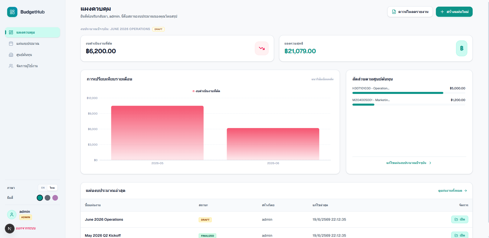
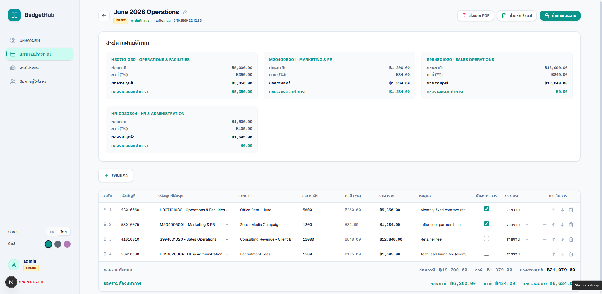
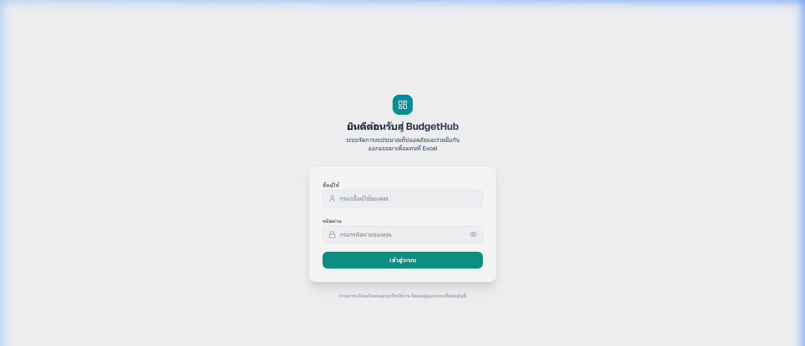

<div align="center">


# BudgetHub

**Offline desktop app for departmental budget management — a friendly replacement for Excel.**
**โปรแกรมเดสก์ท็อปบริหารงบประมาณรายจ่ายแผนก (กฟส./กฟย.) ใช้งานออฟไลน์ แทนการทำใน Excel**

[](https://github.com/ohmomega/budgethub/releases/latest)
[](LICENSE)


</div>

> **🇬🇧 English** and **🇹🇭 ภาษาไทย** below. / มีทั้งภาษาอังกฤษและภาษาไทยด้านล่าง

<p align="center">
  <br>
  <br>
  
</p>

---

# 🇬🇧 English

## What is BudgetHub?

BudgetHub is a **single-user, offline Windows desktop application** for managing
departmental expense budgets. It runs as a normal program in its own window — no
web browser, no internet connection, and no separate database server required.
All data is stored locally in an embedded SQLite file.

## Features

- 📊 **Dashboard** — totals, budget-cut amounts, monthly comparison chart, and cost-center breakdown.
- 🧾 **Spreadsheet-style budget entry** — add/edit/delete line items with auto-save on blur.
- ➕ **Inline cost centers** — editors can add a new cost-center code without leaving the form.
- 🔢 **Fractional row insertion** — insert a row between any two rows without disturbing others.
- 💵 **Server-side calculations** — 7% VAT and totals are always computed by the backend for safety.
- 📜 **Audit logs** — every create/update/delete is recorded with old vs. new values.
- 📤 **Export** — export to Excel (`.xlsx`, formulas preserved) or a PDF report.
- 👥 **Roles** — admin / editor / viewer (the desktop build signs in as the admin user).

## Tech stack / Languages used

| Layer | Technology |
|---|---|
| Language | **JavaScript (Node.js)** |
| Desktop shell | **Electron** |
| Backend API | **Express** |
| Frontend UI | **React** + **Vite**, styled with **Tailwind CSS** |
| Database | **SQLite** (embedded, via `better-sqlite3`) |
| Export | **ExcelJS** (xlsx) and **PDFKit** (pdf) |
| Auth/crypto | **bcryptjs**, **jsonwebtoken** |
| Packaging | **electron-builder** (NSIS installer) |

## Download & install (for users)

1. Go to the **[Releases page](https://github.com/ohmomega/budgethub/releases/latest)** and download **`BudgetHub Setup 1.0.0.exe`**.
2. Run the installer and follow the wizard (you can choose the install folder).
3. Launch **BudgetHub** from the Start Menu or Desktop shortcut.

> **Note about the SmartScreen warning:** the installer is not code-signed, so on
> first run Windows may show *"Windows protected your PC."* Click **More info → Run
> anyway**. This is expected for unsigned apps.

No Node.js, database, or internet connection is required to use the app.

### Default login accounts

| Username | Password | Role |
|---|---|---|
| `admin` | `admin1234` | admin |
| `editor_d01` … `editor_d05` | `password123` | editor |
| `viewer` | `password123` | viewer |

### Where your data lives

The database is created automatically on first launch at:

```
C:\Users\<you>\AppData\Roaming\BudgetHub\budgethub.db
```

- **Back up** that single file to back up all your data.
- **Reset to a fresh database** by deleting that file and relaunching the app.

## Build from source (for developers)

Requires **Node.js 18+** and **npm** on Windows.

```bash
# 1. Clone
git clone https://github.com/ohmomega/budgethub.git
cd budgethub

# 2. Install root dependencies (Electron, backend, build tools)
npm install

# 3. Build the React frontend
npm run build:frontend

# 4. Run the desktop app in development
npm start

# 5. Build the distributable Windows installer
npm run dist
#  -> output: dist_electron\BudgetHub Setup 1.0.0.exe
```

### Project structure

```
budgethub/
├─ electron/main.js      # Desktop shell: window, starts hidden server, first-run DB seed
├─ backend/              # Express API
│  ├─ app.js             #   builds the app + startServer()
│  ├─ db.js              #   SQLite layer with a Postgres-compatible query()
│  ├─ schema.sql         #   table definitions
│  ├─ seed.js            #   builds + seeds the initial database (imports Example/test.xlsx)
│  ├─ routes/            #   auth, master, expenses, export
│  └─ middleware/        #   auth (single-user admin in the desktop build)
├─ frontend/             # React + Vite source (built to frontend/dist)
├─ Example/test.xlsx     # Sample sheet used to seed demo data
└─ build/icon.ico        # App icon
```

---

# 🇹🇭 ภาษาไทย

## BudgetHub คืออะไร?

BudgetHub เป็น **โปรแกรมเดสก์ท็อปบน Windows สำหรับผู้ใช้คนเดียว ทำงานแบบออฟไลน์**
ใช้บริหารงบประมาณรายจ่ายระดับแผนก ทำงานเหมือนโปรแกรมทั่วไปในเครื่อง มีหน้าต่างของตัวเอง
**ไม่ต้องเปิดเบราว์เซอร์ ไม่ต้องต่ออินเทอร์เน็ต และไม่ต้องติดตั้งฐานข้อมูลแยก**
ข้อมูลทั้งหมดถูกเก็บไว้ในไฟล์ SQLite ภายในเครื่อง

## ฟีเจอร์หลัก

- 📊 **แดชบอร์ด** — ยอดรวม, ยอดงบที่ตัด, กราฟเปรียบเทียบรายเดือน และสัดส่วนตามศูนย์ต้นทุน
- 🧾 **กรอกงบแบบตาราง** — เพิ่ม/แก้ไข/ลบ รายการ พร้อมบันทึกอัตโนมัติเมื่อออกจากช่อง (onBlur)
- ➕ **เพิ่มศูนย์ต้นทุนได้ทันที** — ผู้ใช้ระดับ editor พิมพ์เพิ่มรหัสศูนย์ต้นทุนใหม่ได้โดยไม่ต้องออกจากฟอร์ม
- 🔢 **แทรกแถวกลางตาราง** — แทรกแถวระหว่างแถวใดก็ได้โดยไม่กระทบลำดับแถวอื่น
- 💵 **คำนวณฝั่งเซิร์ฟเวอร์** — ภาษี 7% และราคารวมถูกคำนวณโดย backend เสมอเพื่อความปลอดภัยของตัวเลข
- 📜 **บันทึกการแก้ไข (Audit Log)** — บันทึกทุกการเพิ่ม/แก้ไข/ลบ พร้อมค่าก่อน–หลัง
- 📤 **ส่งออกไฟล์** — ส่งออกเป็น Excel (`.xlsx` คงสูตรไว้) หรือรายงาน PDF
- 👥 **สิทธิ์ผู้ใช้** — admin / editor / viewer (เวอร์ชันเดสก์ท็อปเข้าใช้งานในฐานะ admin)

## เทคโนโลยี / ภาษาที่ใช้พัฒนา

| ส่วน | เทคโนโลยี |
|---|---|
| ภาษา | **JavaScript (Node.js)** |
| ตัวห่อเดสก์ท็อป | **Electron** |
| Backend API | **Express** |
| หน้าจอ (UI) | **React** + **Vite** ตกแต่งด้วย **Tailwind CSS** |
| ฐานข้อมูล | **SQLite** (ฝังในตัว ผ่าน `better-sqlite3`) |
| ส่งออกไฟล์ | **ExcelJS** (xlsx) และ **PDFKit** (pdf) |
| การยืนยันตัวตน | **bcryptjs**, **jsonwebtoken** |
| การแพ็กเกจ | **electron-builder** (ตัวติดตั้ง NSIS) |

## ดาวน์โหลดและติดตั้ง (สำหรับผู้ใช้งาน)

1. ไปที่ **[หน้า Releases](https://github.com/ohmomega/budgethub/releases/latest)** แล้วดาวน์โหลด **`BudgetHub Setup 1.0.0.exe`**
2. เปิดไฟล์ติดตั้งและทำตามขั้นตอน (เลือกโฟลเดอร์ติดตั้งได้)
3. เปิดโปรแกรม **BudgetHub** จาก Start Menu หรือไอคอนบนหน้าจอ

> **หมายเหตุเรื่องการเตือนของ SmartScreen:** ไฟล์ติดตั้งยังไม่ได้เซ็นใบรับรอง (code signing)
> ดังนั้นครั้งแรก Windows อาจขึ้นข้อความ *"Windows protected your PC"* ให้กด
> **More info → Run anyway** เป็นเรื่องปกติของโปรแกรมที่ยังไม่ได้เซ็น

การใช้งานโปรแกรม **ไม่ต้องติดตั้ง Node.js ฐานข้อมูล หรือเชื่อมต่ออินเทอร์เน็ต**

### บัญชีผู้ใช้เริ่มต้น

| ชื่อผู้ใช้ | รหัสผ่าน | สิทธิ์ |
|---|---|---|
| `admin` | `admin1234` | admin |
| `editor_d01` … `editor_d05` | `password123` | editor |
| `viewer` | `password123` | viewer |

### ข้อมูลถูกเก็บไว้ที่ไหน

ฐานข้อมูลจะถูกสร้างอัตโนมัติเมื่อเปิดโปรแกรมครั้งแรก ที่:

```
C:\Users\<ชื่อผู้ใช้>\AppData\Roaming\BudgetHub\budgethub.db
```

- **สำรองข้อมูล** โดยคัดลอกไฟล์นี้ไฟล์เดียว
- **รีเซ็ตเป็นฐานข้อมูลใหม่** โดยลบไฟล์นี้แล้วเปิดโปรแกรมใหม่

## พัฒนาต่อจากซอร์สโค้ด (สำหรับนักพัฒนา)

ต้องมี **Node.js 18 ขึ้นไป** และ **npm** บน Windows

```bash
# 1. โคลนโปรเจค
git clone https://github.com/ohmomega/budgethub.git
cd budgethub

# 2. ติดตั้ง dependencies หลัก (Electron, backend, เครื่องมือ build)
npm install

# 3. build หน้าจอ React
npm run build:frontend

# 4. รันแอปเดสก์ท็อปแบบ development
npm start

# 5. สร้างไฟล์ติดตั้งสำหรับแจกจ่าย
npm run dist
#  -> ได้ไฟล์: dist_electron\BudgetHub Setup 1.0.0.exe
```

### โครงสร้างโปรเจค

```
budgethub/
├─ electron/main.js      # ตัวห่อเดสก์ท็อป: เปิดหน้าต่าง, รันเซิร์ฟเวอร์แบบซ่อน, สร้าง DB ครั้งแรก
├─ backend/              # Express API
│  ├─ app.js             #   สร้างแอป + startServer()
│  ├─ db.js              #   ชั้น SQLite ที่รองรับ query() สไตล์ Postgres
│  ├─ schema.sql         #   นิยามตาราง
│  ├─ seed.js            #   สร้างและใส่ข้อมูลเริ่มต้น (นำเข้า Example/test.xlsx)
│  ├─ routes/            #   auth, master, expenses, export
│  └─ middleware/        #   auth (เวอร์ชันเดสก์ท็อปใช้ผู้ใช้ admin คนเดียว)
├─ frontend/             # ซอร์ส React + Vite (build ไปที่ frontend/dist)
├─ Example/test.xlsx     # ไฟล์ตัวอย่างสำหรับใส่ข้อมูลเดโม
└─ build/icon.ico        # ไอคอนแอป
```

---

## License / สัญญาอนุญาต

[MIT License](LICENSE) © 2026 ohmomega
