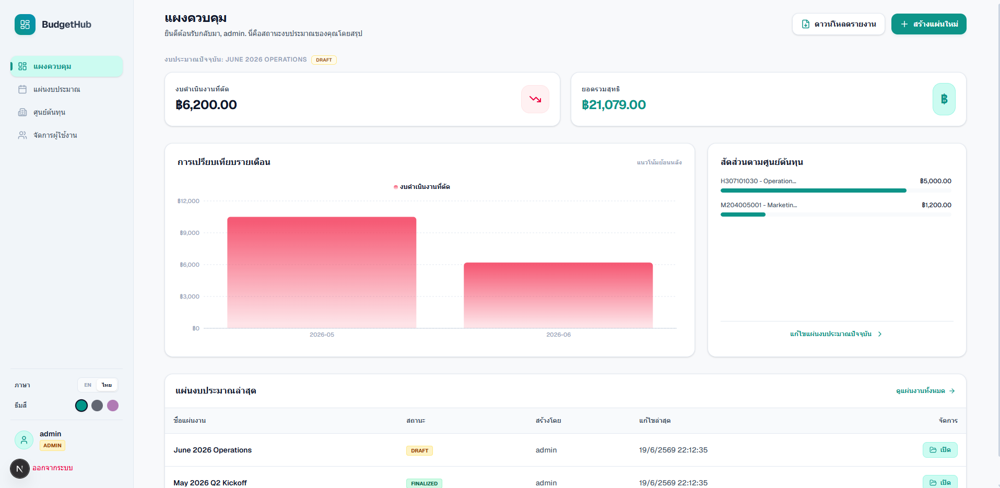
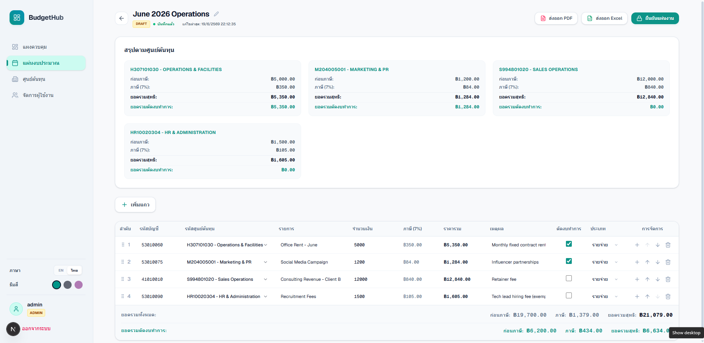

<div align="center">


# BudgetHub

**Offline desktop app for departmental budget management — a friendly replacement for Excel.**
**โปรแกรมเดสก์ท็อปบริหารงบประมาณรายจ่ายแผนก (กฟส./กฟย.) ใช้งานออฟไลน์ แทนการทำใน Excel**

[](https://github.com/ohmomega/budgethub/releases/latest)
[](LICENSE)


</div>

> **🇬🇧 English** and **🇹🇭 ภาษาไทย** below. / มีทั้งภาษาอังกฤษและภาษาไทยด้านล่าง

> ⚠️ **For educational purposes only.** This program and all data shown in it
> (departments, cost-center codes, budget figures, sheets) are intended
> **for learning and demonstration only**. They are not official records and
> must not be used for real financial, accounting, or operational decisions.
>
> ⚠️ **เพื่อการศึกษาเท่านั้น** โปรแกรมนี้และข้อมูลทั้งหมดในโปรแกรม (แผนก รหัสศูนย์ต้นทุน
> ตัวเลขงบประมาณ และแผ่นงาน) จัดทำขึ้น **เพื่อการเรียนรู้และการสาธิตเท่านั้น**
> ไม่ใช่ข้อมูลทางราชการจริง และไม่ควรนำไปใช้ในการตัดสินใจทางการเงิน บัญชี หรือการปฏิบัติงานจริง

<p align="center">
  <br>
  
</p>

---

# 🇬🇧 English

## What is BudgetHub?

BudgetHub is a **single-user, offline Windows desktop application** for managing
departmental expense budgets. It runs as a normal program in its own window — no
web browser, no internet connection, and no separate database server required.
All data is stored locally in an embedded SQLite file.

## Features

- 📊 **Dashboard** — totals, budget-cut amounts, and a comparison chart you can scope to the whole year (default), just this month, or any custom set of months; the title switches between "Monthly" and "Yearly" comparison automatically, and the cost-center breakdown follows the same time range.
- 📈 **Yearly summary report** — a full-year window with a two-bar chart per month (net total + budget cut), exportable to PDF, JPG, or Excel.
- 🧾 **Spreadsheet-style budget entry** — add/edit/delete line items with auto-save; press Enter to confirm a cell. The table fits the window (no horizontal scrolling) and rows can be dragged or moved to reorder.
- 🏢 **Departments** — name-based departments (codes are generated automatically). Manage them from a dedicated page or right inside a sheet. A department that still has budget data can't be deleted until its data is removed.
- 🏦 **Global cost centers** — a cost-center code works across all departments. Add or rename one from the registry, or inline in a sheet without leaving the form.
- 🔒 **Finalize & reopen** — lock a sheet when it's done; reopen it later to edit again.
- 🔢 **Fractional row insertion** — insert a row between any two rows without disturbing others.
- 💵 **Server-side calculations** — 7% VAT and totals are always computed by the backend for safety.
- 📜 **Audit logs** — every create/update/delete is recorded with old vs. new values.
- 📤 **Export** — export a sheet to Excel (`.xlsx`, formulas preserved) or PDF, combine several months into one Excel workbook (a summary page + one detail page per month) from the Budget Sheets list, and export the yearly report to PDF / JPG / Excel.
- 🔐 **Backup & Restore** — download an encrypted, tamper-evident `.bhbackup` file any time and restore from one later (only genuine, unmodified BudgetHub backups are accepted); the app also keeps a 2-copy rotating backup automatically on every close, with no setup required.
- 🆘 **Built-in help & guided setup** — an in-app Help page plus a first-run setup checklist walk new users through departments, cost centers, and sheets.
- 👥 **Single-user** — the desktop build has **no login screen**; it always runs locally as the built-in admin user.

## Tech stack / Languages used

| Layer | Technology |
|---|---|
| Language | **JavaScript (Node.js)** |
| Desktop shell | **Electron** |
| Backend API | **Express** |
| Frontend UI | **React** + **Vite**, styled with **Tailwind CSS** |
| Database | **SQLite** (embedded, via `better-sqlite3`) |
| Export | **ExcelJS** (xlsx) and **PDFKit** (pdf) |
| Auth/crypto | **bcryptjs**, **jsonwebtoken** |
| Packaging | **electron-builder** (NSIS installer) |

## Download & install (for users)

1. Go to the **[Releases page](https://github.com/ohmomega/budgethub/releases/latest)** and download **`BudgetHub Setup 1.0.4.exe`**.
2. Run the installer and follow the wizard (you can choose the install folder).
3. Launch **BudgetHub** from the Start Menu or Desktop shortcut.

No Node.js, database, or internet connection is required to use the app.

### "Unknown publisher" / SmartScreen warning — this is normal

BudgetHub is a free, open-source app and the installer is **not code-signed**
(a code-signing certificate costs money each year). Because of that, Windows and
your browser will warn you that the publisher is "Unknown." The app is safe —
here is how to get past each warning:

**1) While downloading (Edge/Chrome may say the file "isn't commonly downloaded"):**
- Click the **•••** (more) button next to the download, then choose **Keep**.
- If asked again, choose **Keep anyway** / **Show more → Keep anyway**.

**2) When you run `BudgetHub.Setup.1.0.4.exe` (blue "Windows protected your PC" box):**
- Click the **More info** link.
- Then click the **Run anyway** button that appears.

That's it — the installer will start. You only need to do this once. If you'd
rather verify the file first, you can right-click it → **Properties → Digital
Signatures / Details**, or scan it with your antivirus.

### A fresh install starts empty

A new install (or a freshly reset database) opens **completely empty** — no
sample departments, cost centers, or budget sheets — so each office enters its
own data through the app. Start from the **Dashboard** with **Create New Sheet**.
The app ships with no sample data and no way to load any.

### No login — single-user admin mode

The desktop build has **no login screen and no sign-in step**. It always runs
locally as the built-in administrator, so there are no usernames or passwords to
enter.

### Where your data lives

The database is created automatically on first launch at:

```
C:\Users\<you>\AppData\Roaming\BudgetHub\budgethub.db
```

- **Back up your data** with the in-app **Backup & Restore** page (an encrypted, tamper-evident `.bhbackup` file you can save anywhere). The app also keeps its own 2-copy rotating backup automatically, in `...\BudgetHub\backups\`, every time you close it — no setup required.
- Without going through the app at all, copying `budgethub.db` (plus `budgethub.db-wal` / `budgethub.db-shm` if present) is also a complete backup of your data.
- **Reset to a fresh database** by deleting `budgethub.db` and relaunching the app.

## Build from source (for developers)

Requires **Node.js 18+** and **npm** on Windows.

```bash
# 1. Clone
git clone https://github.com/ohmomega/budgethub.git
cd budgethub

# 2. Install root dependencies (Electron, backend, build tools)
npm install

# 3. Build the React frontend
npm run build:frontend

# 4. Run the desktop app in development
npm start

# 5. Build the distributable Windows installer
npm run dist
#  -> output: dist_electron\BudgetHub Setup 1.0.4.exe
```

### Project structure

```
budgethub/
├─ electron/main.js      # Desktop shell: window, starts hidden server, first-run DB seed
├─ backend/              # Express API
│  ├─ app.js             #   builds the app + startServer()
│  ├─ db.js              #   SQLite layer with a Postgres-compatible query()
│  ├─ schema.sql         #   table definitions
│  ├─ seed.js            #   builds + seeds the initial database (admin account only — starts empty)
│  ├─ routes/            #   auth, master, expenses, export
│  └─ middleware/        #   auth (single-user admin in the desktop build)
├─ frontend/             # React + Vite source (built to frontend/dist)
└─ build/icon.ico        # App icon
```

---

# 🇹🇭 ภาษาไทย

## BudgetHub คืออะไร?

BudgetHub เป็น **โปรแกรมเดสก์ท็อปบน Windows สำหรับผู้ใช้คนเดียว ทำงานแบบออฟไลน์**
ใช้บริหารงบประมาณรายจ่ายระดับแผนก ทำงานเหมือนโปรแกรมทั่วไปในเครื่อง มีหน้าต่างของตัวเอง
**ไม่ต้องเปิดเบราว์เซอร์ ไม่ต้องต่ออินเทอร์เน็ต และไม่ต้องติดตั้งฐานข้อมูลแยก**
ข้อมูลทั้งหมดถูกเก็บไว้ในไฟล์ SQLite ภายในเครื่อง

## ฟีเจอร์หลัก

- 📊 **แดชบอร์ด** — ยอดรวม, ยอดงบที่ตัด, กราฟเปรียบเทียบที่เลือกช่วงเวลาได้ (ทั้งปี — ค่าเริ่มต้น / เดือนนี้ / กำหนดเองหลายเดือน) หัวข้อกราฟจะสลับเป็น "รายเดือน"/"รายปี" ให้เองตามที่เลือก และสัดส่วนตามศูนย์ต้นทุนก็รวมข้อมูลตามช่วงเวลาเดียวกัน
- 📈 **รายงานสรุปรายปี** — หน้าต่างรายงานทั้งปี แสดงกราฟ 2 แท่งต่อเดือน (ยอดรวมสุทธิ + งบที่ตัด) ส่งออกเป็น PDF, JPG หรือ Excel ได้
- 🧾 **กรอกงบแบบตาราง** — เพิ่ม/แก้ไข/ลบ รายการ พร้อมบันทึกอัตโนมัติ กด Enter เพื่อยืนยันช่องได้ ตารางพอดีหน้าจอ (ไม่มีแถบเลื่อนแนวนอน) และลาก/เลื่อนแถวเพื่อจัดลำดับได้
- 🏢 **แผนก** — แผนกใช้ชื่อเป็นหลัก (สร้างรหัสให้อัตโนมัติ) จัดการได้ทั้งที่หน้า "จัดการแผนก" และจากในแผ่นงาน แผนกที่ยังมีข้อมูลงบประมาณอยู่จะลบไม่ได้จนกว่าจะลบข้อมูลนั้นก่อน
- 🏦 **ศูนย์ต้นทุนใช้ร่วมกันทุกแผนก** — รหัสศูนย์ต้นทุนหนึ่งรหัสใช้ได้กับทุกแผนก เพิ่มหรือแก้ไขได้จากทะเบียนศูนย์ต้นทุน หรือพิมพ์เพิ่มในแผ่นงานได้ทันที
- 🔒 **ยืนยันและยกเลิกการยืนยันแผ่นงาน** — ล็อกแผ่นงานเมื่อทำเสร็จ และเปิดกลับมาแก้ไขได้ภายหลัง
- 🔢 **แทรกแถวกลางตาราง** — แทรกแถวระหว่างแถวใดก็ได้โดยไม่กระทบลำดับแถวอื่น
- 💵 **คำนวณฝั่งเซิร์ฟเวอร์** — ภาษี 7% และราคารวมถูกคำนวณโดย backend เสมอเพื่อความปลอดภัยของตัวเลข
- 📜 **บันทึกการแก้ไข (Audit Log)** — บันทึกทุกการเพิ่ม/แก้ไข/ลบ พร้อมค่าก่อน–หลัง
- 📤 **ส่งออกไฟล์** — ส่งออกแผ่นงานเป็น Excel (`.xlsx` คงสูตรไว้) หรือ PDF, รวมหลายเดือนเป็น Excel ไฟล์เดียว (หน้าสรุป + รายละเอียดแต่ละเดือน) จากหน้า "แผ่นงบประมาณ" และส่งออกรายงานรายปีเป็น PDF / JPG / Excel
- 🔐 **สำรอง & กู้คืนข้อมูล** — ดาวน์โหลดไฟล์สำรองข้อมูลแบบเข้ารหัสและตรวจสอบการแก้ไขได้ (`.bhbackup`) เมื่อไหร่ก็ได้ แล้วกู้คืนภายหลัง (รับเฉพาะไฟล์ของ BudgetHub ที่ไม่ถูกแก้ไขเท่านั้น) พร้อมสำรองข้อมูลอัตโนมัติแบบหมุน 2 ไฟล์ทุกครั้งที่ปิดโปรแกรม โดยไม่ต้องตั้งค่าอะไรเพิ่ม
- 🆘 **คู่มือในตัวและตัวช่วยตั้งค่าเริ่มต้น** — มีหน้า "คู่มือการใช้งาน" ในโปรแกรม พร้อมเช็คลิสต์ตั้งค่าครั้งแรก แนะนำการสร้างแผนก ศูนย์ต้นทุน และแผ่นงาน
- 👥 **ผู้ใช้คนเดียว** — เวอร์ชันเดสก์ท็อป **ไม่มีหน้าล็อกอิน** ใช้งานในเครื่องในฐานะผู้ดูแล (admin) เสมอ

## เทคโนโลยี / ภาษาที่ใช้พัฒนา

| ส่วน | เทคโนโลยี |
|---|---|
| ภาษา | **JavaScript (Node.js)** |
| ตัวห่อเดสก์ท็อป | **Electron** |
| Backend API | **Express** |
| หน้าจอ (UI) | **React** + **Vite** ตกแต่งด้วย **Tailwind CSS** |
| ฐานข้อมูล | **SQLite** (ฝังในตัว ผ่าน `better-sqlite3`) |
| ส่งออกไฟล์ | **ExcelJS** (xlsx) และ **PDFKit** (pdf) |
| การยืนยันตัวตน | **bcryptjs**, **jsonwebtoken** |
| การแพ็กเกจ | **electron-builder** (ตัวติดตั้ง NSIS) |

## ดาวน์โหลดและติดตั้ง (สำหรับผู้ใช้งาน)

1. ไปที่ **[หน้า Releases](https://github.com/ohmomega/budgethub/releases/latest)** แล้วดาวน์โหลด **`BudgetHub Setup 1.0.4.exe`**
2. เปิดไฟล์ติดตั้งและทำตามขั้นตอน (เลือกโฟลเดอร์ติดตั้งได้)
3. เปิดโปรแกรม **BudgetHub** จาก Start Menu หรือไอคอนบนหน้าจอ

การใช้งานโปรแกรม **ไม่ต้องติดตั้ง Node.js ฐานข้อมูล หรือเชื่อมต่ออินเทอร์เน็ต**

### คำเตือน "Unknown publisher" / SmartScreen — เป็นเรื่องปกติ

BudgetHub เป็นโปรแกรมฟรีและโอเพนซอร์ส ไฟล์ติดตั้ง **ยังไม่ได้เซ็นใบรับรอง (code signing)**
เพราะใบรับรองมีค่าใช้จ่ายรายปี ทำให้ Windows และเบราว์เซอร์ขึ้นเตือนว่าผู้เผยแพร่ "ไม่ทราบ"
โปรแกรมปลอดภัยดี วิธีผ่านการเตือนแต่ละจุดมีดังนี้:

**1) ตอนดาวน์โหลด (Edge/Chrome อาจเตือนว่าไฟล์ "ไม่ค่อยมีคนดาวน์โหลด"):**
- กดปุ่ม **•••** (จุดสามจุด) ข้างไฟล์ที่ดาวน์โหลด แล้วเลือก **Keep / เก็บไฟล์ไว้**
- หากถามซ้ำ ให้เลือก **Keep anyway / เก็บไว้อยู่ดี**

**2) ตอนเปิดไฟล์ `BudgetHub.Setup.1.0.4.exe` (กล่องสีน้ำเงิน "Windows protected your PC"):**
- กดลิงก์ **More info**
- จากนั้นกดปุ่ม **Run anyway** ที่ปรากฏขึ้น

เพียงเท่านี้ตัวติดตั้งก็จะเริ่มทำงาน ทำครั้งเดียวพอ หากต้องการตรวจสอบไฟล์ก่อน
สามารถคลิกขวาที่ไฟล์ → **Properties** หรือสแกนด้วยโปรแกรมแอนตี้ไวรัสได้

### ไม่มีระบบล็อกอิน — ใช้งานในฐานะ admin คนเดียว

เวอร์ชันเดสก์ท็อป **ไม่มีหน้าล็อกอินและไม่มีขั้นตอนเข้าสู่ระบบ** โปรแกรมจะทำงานในเครื่อง
ในฐานะผู้ดูแล (admin) เสมอ จึงไม่มีชื่อผู้ใช้หรือรหัสผ่านให้กรอก

### ข้อมูลถูกเก็บไว้ที่ไหน

ฐานข้อมูลจะถูกสร้างอัตโนมัติเมื่อเปิดโปรแกรมครั้งแรก ที่:

```
C:\Users\<ชื่อผู้ใช้>\AppData\Roaming\BudgetHub\budgethub.db
```

- **สำรองข้อมูล** ผ่านหน้า **สำรอง & กู้คืนข้อมูล** ในโปรแกรม (ได้ไฟล์ `.bhbackup` ที่เข้ารหัสและตรวจสอบการแก้ไขได้ เก็บไว้ที่ไหนก็ได้) นอกจากนี้โปรแกรมยังสำรองข้อมูลอัตโนมัติแบบหมุน 2 ไฟล์ให้เองที่ `...\BudgetHub\backups\` ทุกครั้งที่ปิดโปรแกรม โดยไม่ต้องตั้งค่าอะไรเพิ่ม
- หรือจะไม่ผ่านโปรแกรมเลยก็ได้ แค่คัดลอกไฟล์ `budgethub.db` (พร้อม `budgethub.db-wal` / `budgethub.db-shm` ถ้ามี) ก็ถือเป็นข้อมูลสำรองที่ครบถ้วนแล้ว
- **รีเซ็ตเป็นฐานข้อมูลใหม่** โดยลบไฟล์ `budgethub.db` แล้วเปิดโปรแกรมใหม่

## พัฒนาต่อจากซอร์สโค้ด (สำหรับนักพัฒนา)

ต้องมี **Node.js 18 ขึ้นไป** และ **npm** บน Windows

```bash
# 1. โคลนโปรเจค
git clone https://github.com/ohmomega/budgethub.git
cd budgethub

# 2. ติดตั้ง dependencies หลัก (Electron, backend, เครื่องมือ build)
npm install

# 3. build หน้าจอ React
npm run build:frontend

# 4. รันแอปเดสก์ท็อปแบบ development
npm start

# 5. สร้างไฟล์ติดตั้งสำหรับแจกจ่าย
npm run dist
#  -> ได้ไฟล์: dist_electron\BudgetHub Setup 1.0.4.exe
```

### โครงสร้างโปรเจค

```
budgethub/
├─ electron/main.js      # ตัวห่อเดสก์ท็อป: เปิดหน้าต่าง, รันเซิร์ฟเวอร์แบบซ่อน, สร้าง DB ครั้งแรก
├─ backend/              # Express API
│  ├─ app.js             #   สร้างแอป + startServer()
│  ├─ db.js              #   ชั้น SQLite ที่รองรับ query() สไตล์ Postgres
│  ├─ schema.sql         #   นิยามตาราง
│  ├─ seed.js            #   สร้างและใส่ข้อมูลเริ่มต้น (บัญชี admin เท่านั้น — เริ่มต้นว่างเปล่า)
│  ├─ routes/            #   auth, master, expenses, export
│  └─ middleware/        #   auth (เวอร์ชันเดสก์ท็อปใช้ผู้ใช้ admin คนเดียว)
├─ frontend/             # ซอร์ส React + Vite (build ไปที่ frontend/dist)
└─ build/icon.ico        # ไอคอนแอป
```

---

## License / สัญญาอนุญาต

[MIT License](LICENSE) © 2026 ohmomega
